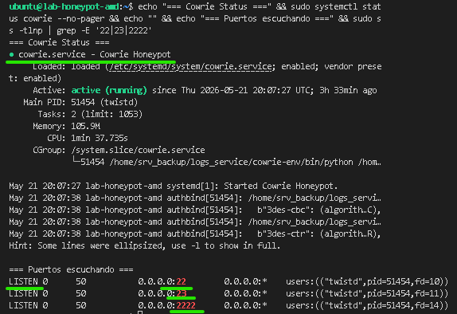
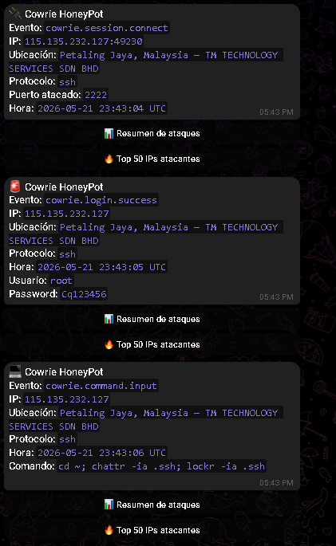
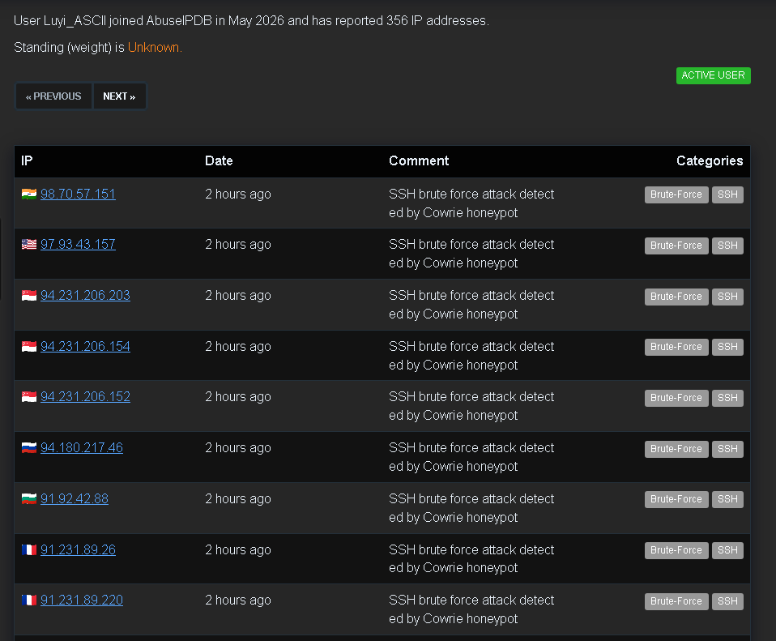
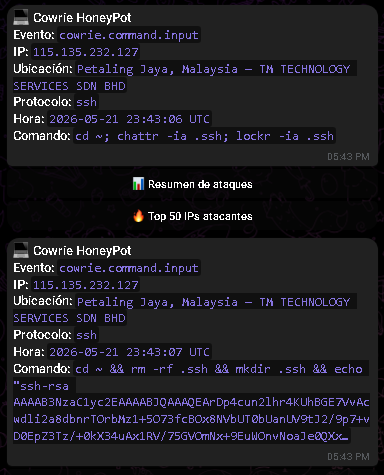

# Honeypot SSH/Telnet en la Nube con Reporte Automatico a AbuseIPDB


> Sistema de trampa activo en la nube que captura, analiza y reporta automaticamente amenazas reales a la comunidad global de ciberseguridad.

---

## Que hace este proyecto?

Este honeypot simula un servidor SSH/Telnet vulnerable expuesto en Internet para atraer atacantes reales. Cada intento de intrusion es **registrado, analizado y reportado automaticamente** a [AbuseIPDB](https://www.abuseipdb.com/), contribuyendo a una base de datos global de amenazas utilizada por miles de organizaciones en el mundo.

```
Internet
    |
    v
[Atacante]──────────────────────────────────────────────┐
                                                         |
                                              ┌──────────v──────────┐
                                              |   OCI Instance      |
                                              |  ┌───────────────┐  |
                                              |  | Cowrie (SSH)  |  |
                                              |  |  Puerto 22    |  |
                                              |  └──────┬────────┘  |
                                              |         |            |
                                              |  ┌──────v────────┐  |
                                              |  |  Log Parser   |  |
                                              |  |   (Python)    |  |
                                              |  └──────┬────────┘  |
                                              └─────────┼───────────┘
                                                        |
                          ┌─────────────────────────────┼───────────────────┐
                          |                             |                   |
               ┌──────────v──────┐          ┌──────────v──────┐  ┌────────v────────┐
               |   Telegram Bot  |          |   AbuseIPDB API |  |  JSON Log File  |
               |  Alerta en      |          |  Reporte de IP  |  |  Almacenamiento |
               |  tiempo real    |          |  maliciosa      |  |  local          |
               └─────────────────┘          └─────────────────┘  └─────────────────┘
```

---

## Objetivos del Proyecto

- **Recoleccion de Inteligencia:** Capturar TTPs (Tacticas, Tecnicas y Procedimientos) de atacantes reales
- **Contribucion Comunitaria:** Reportar IPs maliciosas a AbuseIPDB para proteger a otros sistemas
- **Alertas en Tiempo Real:** Notificacion instantanea via Telegram de cada intento de intrusion
- **Analisis de Patrones:** Identificar tendencias de ataque, paises de origen y herramientas usadas

---

## Stack Tecnologico

| Componente | Tecnologia | Funcion |
|---|---|---|
| **Honeypot** | Cowrie | Simula servidor SSH/Telnet vulnerable |
| **Infraestructura** | Oracle Cloud (OCI) | Instancia expuesta en Internet |
| **Alertas** | Python + Telegram API | Notificaciones en tiempo real |
| **Reporte** | Python + AbuseIPDB API | Reporte automatico de IPs maliciosas |
| **SO** | Debian/Ubuntu Linux | Sistema base del servidor |
| **Logs** | JSON + Cowrie logs | Almacenamiento de eventos |

---

## Arquitectura de Infraestructura

```
Oracle Cloud Infrastructure (OCI)
┌─────────────────────────────────────┐
|  Virtual Cloud Network (VCN)        |
|  ┌───────────────────────────────┐  |
|  |  Compute Instance (VM)        |  |
|  |  ┌─────────────────────────┐  |  |
|  |  |  Ubuntu Server          |  |  |
|  |  |  ├── Cowrie (SSH :22)   |  |  |
|  |  |  ├── Cowrie (Tel :23)   |  |  |
|  |  |  └── Python Scripts     |  |  |
|  |  └─────────────────────────┘  |  |
|  |  Security List:               |  |
|  |  ├── Ingress: 22, 23 (0.0.0.0)|  |
|  |  └── Egress: All              |  |
|  └───────────────────────────────┘  |
└─────────────────────────────────────┘
```

---

## Instalacion y Configuracion

### Prerrequisitos
- Cuenta en Oracle Cloud (Free Tier disponible)
- Python 3.8+
- Token de Bot de Telegram
- API Key de AbuseIPDB

### 1. Clonar el repositorio
```bash
git clone https://github.com/Luyi-gg/honeypot-cowrie-oci.git
cd honeypot-cowrie-oci
```

### 2. Instalar dependencias
```bash
# Instala todas las librerias necesarias definidas en requirements.txt
# Incluye: requests, python-dotenv, watchdog
pip install -r requirements.txt
```

### 3. Instalar y configurar Cowrie
```bash
# Instalar dependencias del sistema necesarias para compilar Cowrie
sudo apt-get install git python3-virtualenv libssl-dev libffi-dev build-essential python3-dev

# Crear un usuario dedicado para Cowrie
# Buena practica: nunca correr el honeypot como root
sudo adduser --disabled-password cowrie

# Clonar el repositorio oficial de Cowrie en el home del usuario
sudo -u cowrie git clone https://github.com/cowrie/cowrie /home/cowrie/cowrie
cd /home/cowrie/cowrie

# Crear un entorno virtual aislado para las dependencias de Cowrie
# Esto evita conflictos con otras versiones de Python en el sistema
sudo -u cowrie virtualenv cowrie-env

# Instalar las dependencias de Python dentro del entorno virtual
sudo -u cowrie cowrie-env/bin/pip install -r requirements.txt
```

### 4. Configurar variables de entorno
```bash
# Copiar el archivo de ejemplo como punto de partida
cp .env.example .env
```
Edita `.env` con tus credenciales:
```env
# Token del bot de Telegram - se obtiene hablando con @BotFather en Telegram
TELEGRAM_BOT_TOKEN=tu_token_aqui

# ID del chat donde el bot enviara las alertas
# Puedes obtenerlo hablando con @userinfobot en Telegram
TELEGRAM_CHAT_ID=tu_chat_id_aqui

# API Key de AbuseIPDB - se genera gratis en abuseipdb.com/register
ABUSEIPDB_API_KEY=tu_api_key_aqui

# Ruta al archivo de logs JSON generado por Cowrie
# Este es el path por defecto de instalacion
COWRIE_LOG_PATH=/home/cowrie/cowrie/var/log/cowrie/cowrie.json
```

### 5. Ejecutar el monitor
```bash
# Inicia el script principal que monitorea los logs en tiempo real
# Recomendado: correr dentro de un screen o tmux para que persista en segundo plano
python3 src/monitor.py
```

---

## Estructura del Proyecto

```
honeypot-cowrie-oci/
│
├── README.md                   # Documentacion principal del proyecto
├── requirements.txt            # Dependencias de Python (requests, dotenv, watchdog)
├── .env.example                # Plantilla de variables de entorno (sin datos reales)
│
├── src/
│   ├── monitor.py              # Script principal: vigila el archivo de logs en tiempo real
│   ├── telegram_alert.py       # Modulo que construye y envia alertas via Telegram Bot API
│   ├── abuseipdb_report.py     # Modulo que reporta IPs maliciosas a la API de AbuseIPDB
│   └── log_parser.py           # Parser que lee y estructura los logs JSON de Cowrie
│
├── docs/
│   ├── setup_oci.md            # Guia paso a paso: crear instancia en Oracle Cloud
│   ├── setup_cowrie.md         # Guia de instalacion y configuracion de Cowrie
│   └── architecture.md         # Diagrama detallado de la arquitectura del sistema
│
└── data/
    └── sample_logs/            # Logs de ejemplo con IPs anonimizadas para referencia
```

---

## Datos Recolectados (Muestra)

Ejemplo de eventos capturados en las primeras 24 horas de operacion:

```json
{
  "timestamp": "2026-05-10T03:42:17",
  "src_ip": "XX.XX.XX.XX",
  "country": "CN",
  "username": "root",
  "password": "admin123",
  "commands_executed": ["cat /etc/passwd", "wget http://[redacted]"],
  "session_duration": "00:02:34"
}
```

## Estadisticas del Honeypot

| Metrica | Valor |
|---|---|
| IPs unicas detectadas | 2,970 |
| IPs bloqueadas | 2,702 |
| Intentos totales | 182,013 |
| Logins fallidos | 6,095 |
| Logins exitosos | 13,815 |
| Comandos ejecutados | 13,616 |
 

---

### Top 20 IPs mas agresivas

| # | IP | Intentos | Pais |
|---|---|---|---|
| 1 | 45.85.180.143 | 59,568 | DO |
| 2 | 139.59.236.63 | 6,138 | SG |
| 3 | 87.251.64.176 | 4,574 | PL |
| 4 | 192.109.200.237 | 3,567 | NL |
| 5 | 213.209.159.154 | 3,530 | DE |
| 6 | 176.65.132.129 | 3,507 | NL |
| 7 | 176.65.132.17 | 3,203 | NL |
| 8 | 45.156.87.204 | 3,159 | NL |
| 9 | 85.11.167.2 | 2,154 | BG |
| 10 | 141.227.190.54 | 1,915 | CZ |
| 11 | 138.2.98.41 | 1,252 | SG |
| 12 | 141.148.175.56 | 1,172 | US |
| 13 | 161.97.109.235 | 1,078 | FR |
| 14 | 64.110.90.250 | 998 | KR |
| 15 | 138.2.232.2 | 906 | US |
| 16 | 128.199.87.229 | 836 | SG |
| 17 | 129.213.137.74 | 834 | US |
| 18 | 129.153.145.135 | 829 | US |
| 19 | 206.189.156.94 | 818 | SG |
| 20 | 209.97.161.72 | 782 | SG |

---
### Top 10 Paises Atacantes

| # | País | IPs únicas | % del total |
|---|------|-----------|-------------|
| 🥇 1 | 🇺🇸 United States | 657 | 19.6% |
| 🥈 2 | 🇨🇳 China | 390 | 11.6% |
| 🥉 3 | 🇩🇴 Dominican Republic | 193 | 5.7% |
| 4 | 🇬🇧 United Kingdom | 133 | 4.0% |
| 5 | 🇧🇷 Brazil | 95 | 2.8% |
| 6 | 🇸🇬 Singapore | 86 | 2.6% |
| 7 | 🇭🇰 Hong Kong | 62 | 1.8% |
| 8 | 🇮🇳 India | 62 | 1.8% |
| 9 | 🇩🇪 Germany | 61 | 1.8% |
| 10 | 🇳🇱 The Netherlands | 53 | 1.6% |


---






## Contribucion a la Comunidad

Este proyecto reporta automaticamente IPs maliciosas a **[AbuseIPDB](https://www.abuseipdb.com/)**, una base de datos colaborativa utilizada por:

- Empresas de seguridad
- Proveedores de hosting
- Firewalls y sistemas IDS/IPS en todo el mundo

Cada IP reportada incluye:
- Categoria de ataque (SSH Brute Force)
- Timestamp del evento
- Descripcion del comportamiento observado

> Si quieres hacer tu propio reporte, puedes obtener una API Key gratuita en [abuseipdb.com](https://www.abuseipdb.com/register)

---

## Ejemplo de Alerta en Telegram

```
[ALERTA] INTENTO DE INTRUSION DETECTADO

IP: XX.XX.XX.XX
Pais: Russia (RU)
Usuario: root
Contrasena: toor123
Comandos ejecutados:
   -- uname -a
   -- cat /etc/shadow
   -- wget http://[redacted]/payload.sh

Duracion sesion: 1m 47s
Reportado a AbuseIPDB: SI
```

---

## Configuracion Avanzada del Honeypot

### Multiples puertos de escucha

Por defecto Cowrie solo escucha en el puerto 22 (SSH). Se modifico la configuracion para escuchar en puertos adicionales comunmente atacados, y cada evento registra en que puerto ocurrio el intento:

```ini
# cowrie.cfg - Seccion de puertos
# Cowrie corre en puertos altos para no requerir permisos root (>1024)
# Se usa iptables para redirigir el trafico de los puertos reales hacia estos

[ssh]
# Puerto interno donde Cowrie escucha realmente
listen_port = 2222

[telnet]
# Telnet habilitado para capturar atacantes que usan protocolos legacy
listen_port = 2323
enabled = true
```

```bash
# Redireccion de puertos con iptables
# El trafico que llega al puerto 22 real se redirige al puerto interno 2222 de Cowrie
sudo iptables -t nat -A PREROUTING -p tcp --dport 22 -j REDIRECT --to-port 2222

# Lo mismo para Telnet: trafico en puerto 23 -> puerto interno 2323
sudo iptables -t nat -A PREROUTING -p tcp --dport 23 -j REDIRECT --to-port 2323

# Puerto 2222 adicional expuesto directamente (algunos scanners lo prueban)
sudo iptables -t nat -A PREROUTING -p tcp --dport 2222 -j REDIRECT --to-port 2222

# Guardar las reglas para que persistan al reiniciar el servidor
sudo iptables-save > /etc/iptables/rules.v4
```

El log parser fue modificado para extraer y registrar el puerto de destino en cada evento:

```python
# log_parser.py
# Cowrie registra cada conexion en formato JSON
# Este fragmento extrae el puerto ademas de los datos estandar

def parse_event(event: dict) -> dict:
    return {
        "timestamp":  event.get("timestamp"),
        "src_ip":     event.get("src_ip"),
        # dst_port indica en que puerto fue recibido el ataque
        # util para saber si el atacante usó SSH estandar, Telnet, o un puerto alternativo
        "dst_port":   event.get("dst_port", "unknown"),
        "username":   event.get("username"),
        "password":   event.get("password"),
        "commands":   event.get("input", []),
        "session":    event.get("session"),
    }
```

---

### Camuflaje del Honeypot (Deception)

Una parte clave del diseno es hacer que el servidor parezca un sistema real en produccion. Cuanto mas convincente se vea, mas tiempo permanece el atacante y mas inteligencia se recolecta.

**Banner SSH personalizado**

El banner es lo primero que ve el atacante al conectarse. Se modifico para imitar un servidor Ubuntu real de una empresa generica:

```ini
# cowrie.cfg
[honeypot]

# Nombre del host que vera el atacante al conectarse
# Evitar nombres obvios como "honeypot", "trap" o "sandbox"
hostname = web-prod-01

# Banner que se muestra antes del login
# Imita el banner estandar de un servidor Ubuntu en produccion
banner_file = etc/banner.txt
```

```
# etc/banner.txt
# Texto que ve el atacante antes de introducir credenciales
# Usa lenguaje corporativo generico para mayor credibilidad
Ubuntu 22.04.3 LTS - Authorized access only.
All connections are monitored and recorded.
Disconnect IMMEDIATELY if you are not an authorized user.
```

**Usuario falso con permisos aparentes**

```ini
# userdb.txt - Lista de credenciales que Cowrie acepta intencionalmente
# El atacante cree que ha entrado con exito al sistema
# Formato: usuario:uid:contrasena

# Usuario con nombre corporativo generico para mayor realismo
admin:0:admin
admin:0:admin123
admin:0:password
root:0:root
root:0:toor
root:0:123456
```

**Variables del sistema falsas**

```ini
# cowrie.cfg - Sistema operativo simulado
# Estos valores se muestran cuando el atacante ejecuta comandos como uname -a
[shell]

# Simular un kernel ligeramente desactualizado
# Los atacantes suelen buscar versiones vulnerables especificas
kernel_version = 5.15.0-75-generic
kernel_build_string = #82-Ubuntu SMP Tue Jun 27 15:25:03 UTC 2023

# Nombre del sistema que aparece en los logs del atacante
hostname = web-prod-01

# Hardware simulado - servidor generico de produccion
hardware_platform = x86_64
operating_system = GNU/Linux
```

Con esta configuracion el atacante ve esto al conectarse y ejecutar comandos basicos:

```
# Lo que ve el atacante tras entrar con root:root
root@web-prod-01:~# uname -a
Linux web-prod-01 5.15.0-75-generic #82-Ubuntu SMP Tue Jun 27 15:25:03 UTC 2023 x86_64 GNU/Linux

root@web-prod-01:~# whoami
root

# El atacante cree que tiene acceso root real y sigue ejecutando comandos
# mientras Cowrie los registra todos silenciosamente
root@web-prod-01:~# cat /etc/passwd
```

---

## Lo que aprendi

- Despliegue y administracion de instancias en **Oracle Cloud Infrastructure**
- Configuracion y operacion de **honeypots SSH/Telnet con Cowrie**
- Integracion de **APIs externas** (Telegram, AbuseIPDB) con Python
- Analisis de **logs en tiempo real** y deteccion de patrones de ataque
- Conceptos practicos de **Threat Intelligence** y contribucion comunitaria
- Hardening basico de servidores Linux expuestos en Internet

---

## ⚠️ Disclaimer

> Este proyecto esta disenado **unicamente con fines educativos y de investigacion en ciberseguridad**. El honeypot opera en una instancia aislada en la nube, sin conexion a sistemas de produccion ni datos sensibles. Todos los datos de IPs publicados en este repositorio estan **anonimizados**. El autor no se hace responsable del uso indebido de las tecnicas aqui documentadas.

---

## Contacto

**Luis SC**
- [LinkedIn](https://linkedin.com/in/luis-angel-sc)
- [GitHub](https://github.com/luis-angel-sc)

---

Si este proyecto te fue util o aprendiste algo, considera darle una estrella al repositorio. Ayuda a que mas personas lo encuentren.
